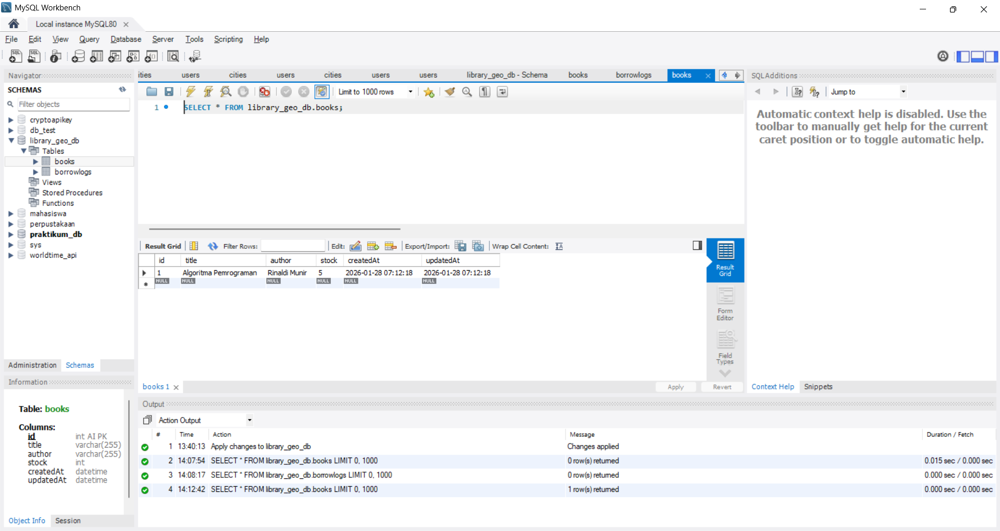
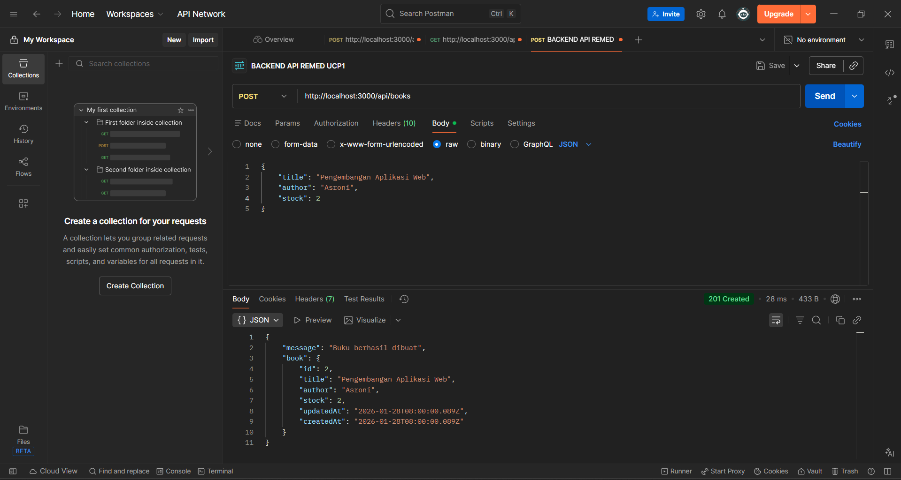
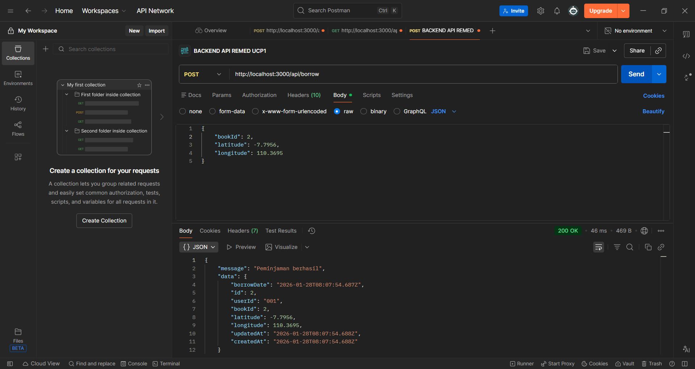

# Library System with Geolocation (Backend API)

## 🛠 Teknologi yang Digunakan
- **Node.js** & **Express.js** (Framework Backend)
- **MySQL** (Database)
- **Sequelize** (ORM untuk interaksi database)

---

## 🚀 Cara Menjalankan Aplikasi

Ikuti langkah-langkah berikut untuk menjalankan server di komputer lokal:

# 1. Persiapan Database
1. Pastikan **XAMPP** sudah terinstal dan module **MySQL** sudah dinyalakan.
2. Buka `http://localhost/phpmyadmin`.
3. Buat database baru dengan nama: **`library_geo_db`**.
4. Cek file `config/database.js` dan pastikan konfigurasi username/password sesuai dengan XAMPP Anda (User: `root`, Password: kosongkan).

# 2. Instalasi Dependensi
Buka terminal di dalam folder project (`backend/`), lalu jalankan:
npm install

# 3. Jalankan Server
Jalankan perintah berikut untuk memulai server dan membuat tabel database otomatis (Auto-migrate):
node app.js

Jika berhasil, akan muncul pesan:
Database synced Server running on port 3000

📚 Dokumentasi API (Endpoints)
Gunakan Postman untuk menguji endpoint di bawah ini:

A. Public (Bisa diakses siapa saja)
Method,Endpoint,Deskripsi
GET,/api/books,Melihat semua daftar buku
GET,/api/books/:id,Melihat detail buku berdasarkan ID

B. Admin Mode
Wajib menggunakan Header: x-user-role: admin

Method - Endpoint - Body Payload (JSON) - Deskripsi

POST - /api/books - "{""title"": ""Judul"",""author"": ""Penulis"",""stock"": 10}" - Menambah buku baru

PUT - /api/books/:id - "{""stock"": 15}" - Update data buku

DELETE - /api/books/:id - (-) - Menghapus buku

C. User Mode (Peminjaman)
Wajib menggunakan Header:

x-user-role: user
x-user-id: 001 (Ganti dengan ID user simulasi)

Method - Endpoint - Body Payload (JSON) - Deskripsi

POST - /api/borrow - "{""bookId"": 1, ""latitude"": -7.795, ""longitude"": 110.369}" - Meminjam buku & catat lokasi

STRUKTUR DATABASE

TEST ENDPOINT TAMBAH BUKU (ADMIN)

Test Endpoint: Peminjaman Buku (User)

